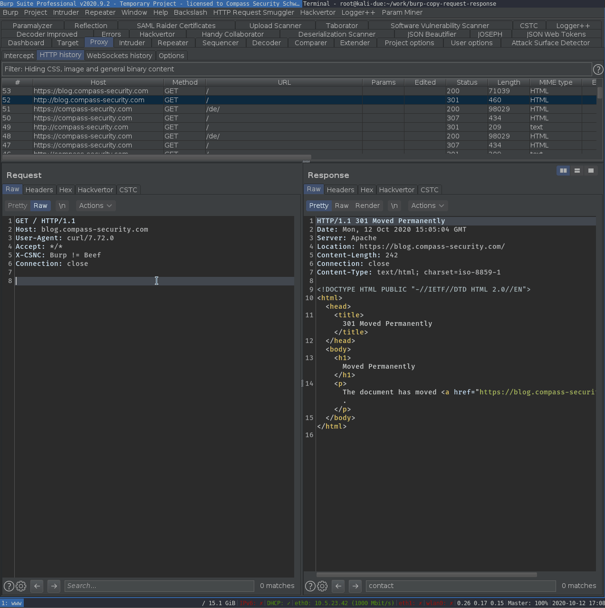

# Burp Extension: Copy Request & Response

## Description

Writing good reports is key in penetration tests / security assessments, since
this is the final result delivered to the customer. Vulnerabilities should be
described in a way so that the customer can understand and also reproduce the
issue. For web application pentests, the best way is often to show the HTTP
requests and responses to explain an issue. This Burp Suite extension "Copy
Request & Response" can assist you while the report.

When copying request/response from Burp, the workflow is often like this:

1. Select the request
2. Copy to clipboard
3. Switch to your reporting tool (Word, Markdown, Web App, LaTeX Editor, `$YOUNAMEIT`)
4. Paste the request
5. Switch back to Burp
6. Select the response (or only part of it if body is too big and you ony want to show the issue)
7. Copy to clipboard
8. Switch back to the report
9. Paste again
10. Add context to explain the request / response

The Copy Request & Response Burp Suite extension adds new context menu
entries that can be used to simply copy the request and response from the
selected message to the clipboard. 

The workflow can then look like this:

1. Select what you want to copy from the context menu
2. Switch to the reporting tool
3. Paste
4. Add context to explain the request / response

Much easier, right? 😉

From a technical view, this is probably the most boring Burp Suite extension.
However, it allows you to spend more time on testing than documenting.

## Features

The extension offers the following copy methods in the context menu of selected
messages and request / responses:

- Copy entire request & response of selected message
- Copy entire request & response header
- Copy entire request & response header + selected response data

Screenshot:

## Demo

The following demo shows the 3 different copy methods:

## Requirements

- Python environment / Jython for Burp Suite

## Installation

The extension is available in the BApp Store:
https://portswigger.net/bappstore/0d05f52c00a64cb2b2bea68744f6316c

See the PortSwigger documentation on how to install Python extensions:
https://portswigger.net/support/how-to-install-an-extension-in-burp-suite.

## Known Issue

If you are testing in a virtual machine, the clipboard can be messed up when
text is still selected after choosing a context menu entry. Therefore, when the
copy method of selected response data is choosen, the copying process is
started in a separate thread and copies the content after 1.5 seconds to the
clipboard. So you have to wait 1.5 seconds before switching to your reporting
tool.

I know, this is an ugly hack. Better ideas / fixes / PRs are welcome!

## Author

- Emanuel Duss (GitHub: [mindfuckup](https://github.com/mindfuckup), Twitter: [mindfuckup](https://twitter.com/mindfuckup))
